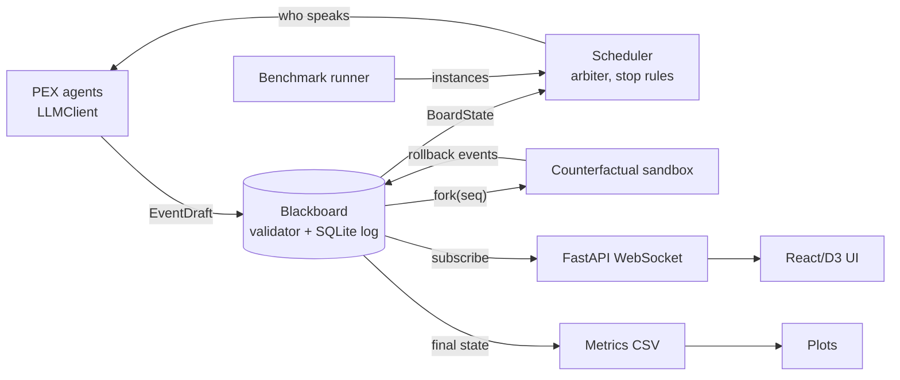

# System description (draft, D6: Person 1's part)

> Draft for the paper's "System" section. Numbers in brackets are placeholders to fill from the
> final runs. Section references (§) point to `docs/spec_pxp_n.md`.

## Overview

The system is built around one append-only event log. Every component either appends to it or
reads from it, and every view of a session, live or historical, is a pure function of a prefix of
that log. The components are: the blackboard (store, validator and state reconstruction), the
PEX agents, an event-driven scheduler, a counterfactual sandbox, a WebSocket server with a
browser UI, and a benchmark engine (ingestion, judging, a resumable runner, metrics and plots).

## Event log and blackboard

Each event is a record `(seq, session_id, author, kind, tag, reply_to, prediction, explanation,
counterfactual, tokens{in,out}, meta)` (§2). `kind` is `message` or one of `rollback_start`,
`rollback_step`, `rollback_end`. Events are stored in SQLite with `(session_id, seq)` as the key;
database triggers reject `UPDATE` and `DELETE`, so the log is append-only by construction. Appends
are serialised by a lock and validated against the session's history before a `seq` is assigned,
which keeps `seq` contiguous under concurrent writers (tested with threads and asyncio tasks
writing to two sessions at once).

The board state (each agent's latest prediction, termination and stop reason, an open rollback,
and token totals with rollback tokens separated) is a left fold over the log. The store caches the
current fold, and `snapshot(session, seq)` recomputes it from the log for any earlier `seq`; the
UI's history scrubber and the tests both rely on the two agreeing at every point.

## Protocol: PXP-N

We keep the two-party PXP tags of Baskar et al. and their guard table: a reply is RATIFY when the
predictions match and the explanations agree, REJECT when neither holds, and REVISE or REFUTE in
the mixed cases depending on whether the receiver, after learning from the message, now agrees
(§1). To run PXP on a board with N agents we require every non-INIT message to carry a
`reply_to` pointing at another agent's earlier message, which decomposes the board into pairwise
exchanges (§2, decision 2). Each agent opens with one INIT; only the scheduler writes TERM.

The validator rejects off-protocol events with a reason (for example a reply to one's own message,
a second INIT, anything after TERM, or a rollback of another agent's message). Transitions that
compatible agents could not produce (paper Prop. 5, e.g. REFUTE in reply to RATIFY) are accepted
but recorded as warnings, because with more than two agents a third party may legitimately dispute
a ratified message; the metrics report how often this happens.

## Intelligibility classifier

For each ordered pair (m, n) we collect T_mn, the tags m sent in reply to n's messages, ignoring
INIT, TERM and all counterfactual events. The pair is one-way intelligible when T_mn contains a
RATIFY or REVISE and no REJECT (paper Def. 1). A session is **Strong** when it has at least one
interacting pair and every interacting pair is one-way intelligible, and **Ultra-Strong** when it is
Strong and contains at least one REVISE (§3). The classifier returns the per-pair table as well as
the label, so looser definitions can be computed after the fact; it is tested on the paper's own
worked examples.

## Scheduler

The scheduler is event-driven: after every append it recomputes the board state, checks the stop
rules and asks the next agent(s) to act. Priority goes to agents that have not yet sent INIT, then
to agents challenged by a REFUTE or REJECT since they last spoke, then to the longest-silent agent,
with ties broken by name so runs are deterministic. A semaphore caps how many agents think at
once. A session stops on:

- **consensus**: every agent has replied at least once and all latest predictions are equivalent;
- **impasse**: over the last W = 2N replies there was no RATIFY, REVISE or prediction change, or
  the consensus distance never improved on its earlier best (the *stall* rule, which catches an
  agent oscillating between two camps), or every agent passed on the same board;
- **cap**: 10N messages.

Equivalence and consensus distance are pluggable, so exact matching is used for choice-format
benchmarks and a ROUGE-based rule for open-ended answers.

## Counterfactual replay

A counterfactual-enabled agent may roll back one of its own past messages. The sandbox forks the
store up to that message (an independent in-memory copy, so the real board cannot change), replaces
the message with an alternative tag and explanation, and re-queries each other agent once (§5,
decision 4). The replay is written back to the real log as `rollback_start`, `rollback_step`* and
`rollback_end` events marked `counterfactual`, with the credit delta (the change in consensus
distance relative to what actually happened) in `rollback_end`. These events are excluded from
intelligibility and stopping decisions, but their tokens count towards H3.

## Interface

A FastAPI server exposes the sessions, their events up to any `seq`, and server-side snapshots, and
streams events over a WebSocket (backlog first, then live events, de-duplicated by `seq`). The
React/D3 UI shows each session as swimlanes (one per agent) with reply arrows coloured by tag, a
history scrubber that replays the session from the log, the rebuilt state and per-pair
intelligibility at the chosen point, and a split panel that puts each counterfactual replay next to
what really happened, with its credit delta and token cost.

## Benchmark engine and reproducibility

The MSCoRe ingestor downloads the benchmark's files on demand, parses its four task formats, and
draws a seeded sample per (domain, difficulty) with stable instance ids. Each finished trial writes
one fsynced row to a metrics CSV (convergence, stop reason, tag counts, rollbacks, intelligibility
class, tokens with rollback tokens separated), keyed by `config|benchmark|instance|seed`; the runner
skips keys already present, so interrupted Colab runs resume without repeating work. Figures and the
summary table are regenerated from that CSV by one command. All randomness (sampling, mock agents,
bootstrap intervals) is seeded.

Implementation: Python 3.11 (asyncio, Pydantic, SQLite, FastAPI) and TypeScript (React, D3), [N]
tests; code at github.com/liteleliya/Reasoning-AI-Agents---Kasukabe-Defence-Group.
